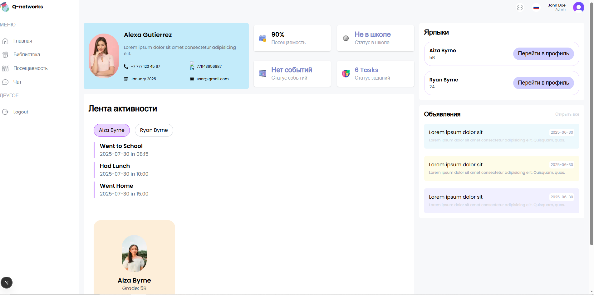

# SmartSchool Microservices

## Описание проекта
SmartSchool — это комплекс микросервисов для образовательных учреждений, предназначенный для интеграции различных систем: контроля доступа, идентификации пользователей, школьного питания, библиотеки и коммуникаций. Система построена по микросервисной архитектуре и интегрируется с биометрической системой **ZKBio Security**.

Проект решает задачу синхронизации данных о пользователях, управления доступом и учёта социальных услуг (школьное питание, библиотека), а также обеспечивает внутренние коммуникации через чат-сервис.

## Моя роль
Я как backend-разработчик занимался:
- проектированием архитектуры микросервисов;
- реализацией сервисов на языке Go;
- настройкой взаимодействия через gRPC и gRPC-Gateway;
- интеграцией с внешними системами (ZKBio Security);
- проектированием и оптимизацией базы данных PostgreSQL;
- реализацией асинхронных коммуникаций через RabbitMQ;
- обеспечением документирования API через Swagger;
- настройкой контейнеризации и окружений с Docker и Docker Compose.

## Архитектура

Основные сервисы проекта:

- **Chat API** — peer-to-peer и групповой чат с хранением истории сообщений в MongoDB, поддержкой поиска и фильтрации, WebSocket и gRPC API.
- **Person Dumper** — сервис синхронизации пользователей из системы ZKBio Security, интеграция с `person-api`, автоматическая вставка данных по школам и отделам. Работает с PostgreSQL.
- **Person API** — микросервис для управления пользователями и связанной информацией (ученики, администраторы, преподаватели). Использует PostgreSQL.
- **Social Wallet Service** — сервис для активации/деактивации ваучеров на школьное питание и получения истории транзакций.
- **API Gateway** — единая точка входа для фронтенда, маршрутизация запросов к микросервисам, gRPC-Gateway для REST-доступа.

## Используемые технологии

- **Язык разработки**: Go (Golang)
- **Коммуникация сервисов**: gRPC, gRPC-Gateway (REST API)
- **Базы данных**: PostgreSQL (Person API, Person Dumper, Social Wallet), MongoDB (Chat API)
- **Брокеры сообщений**: RabbitMQ
- **Документация API**: Swagger
- **Контейнеризация**: Docker, Docker Compose
- **Интеграции**: ZKBio Security API
- **Мониторинг и метрики** (в планах): Prometheus, Grafana

## Функциональность

1. **Синхронизация пользователей**
   - Импорт данных из ZKBio Security.
   - Автосоздание связей между школами и отделами.
   - Поддержка многосхемной архитектуры в PostgreSQL.

2. **Чат-сервис**
   - Peer-to-peer и групповые сообщения.
   - Хранение и доставка недоставленных сообщений.
   - Фильтрация и поиск по истории.

3. **Социальное питание**
   - Активация и деактивация ваучеров.
   - Получение истории транзакций в реальном времени.

4. **API Gateway**
   - Централизованный доступ к микросервисам.
   - REST и gRPC интерфейсы для фронтенда.
   - Встроенные health-check и version endpoint.

5. **Person API**
   - Управление учениками и администраторами.
   - Поддержка SCUD-аутентификации.
   - Работа с PostgreSQL и многосхемной структурой.
